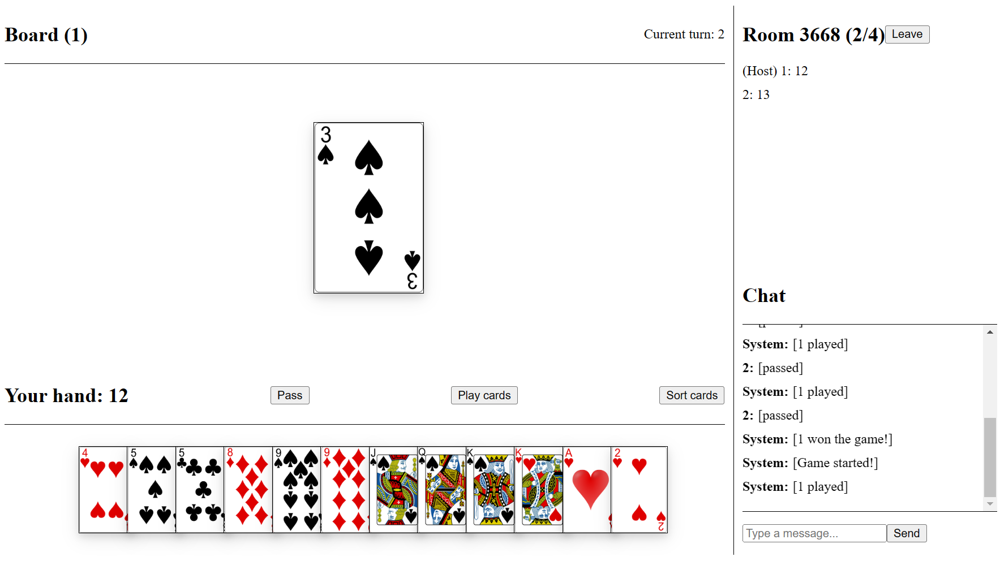

Big Two Game
============

This is a multiplayer card game built with Node.js, Express.js, and React.js, using WebSockets for real-time communication.



Getting Started
---------------

These instructions will get you a copy of the project up and running on your local machine for development and testing purposes.

### Prerequisites

*   Node.js
*   npm (comes with Node.js)

### Installing

1.  Clone the repository

```bash
git clone https://github.com/cuongvnz/big-two-vn.git
```

2.  Install dependencies

`npm install`

3.  Start the server

```sql
npm start
```

4.  Open [http://localhost:3000](http://localhost:3000) in your browser to see the game in action.

Built With
----------

*   [Node.js](https://nodejs.org/) - JavaScript runtime
*   [Express.js](https://expressjs.com/) - Web framework for Node.js
*   [React.js](https://reactjs.org/) - JavaScript library for building user interfaces
*   [WebSockets](https://developer.mozilla.org/en-US/docs/Web/API/WebSockets_API) - Protocol for real-time communication

Author
------

*   **CuongVnZ** - [Github](https://github.com/CuongVnZ)

License
-------

This project is licensed under the MIT License - see the [LICENSE](LICENSE) file for details.